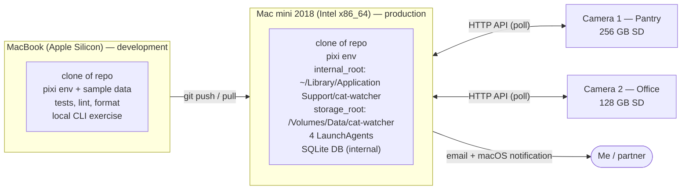
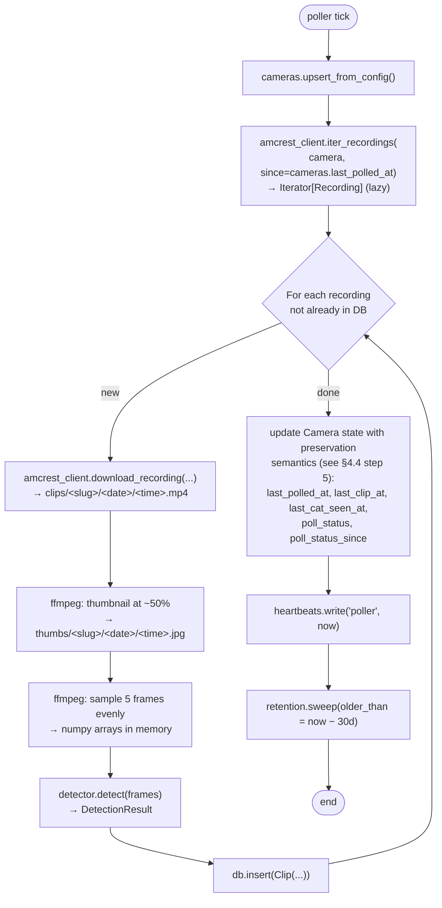
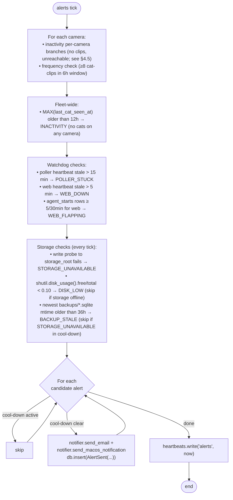
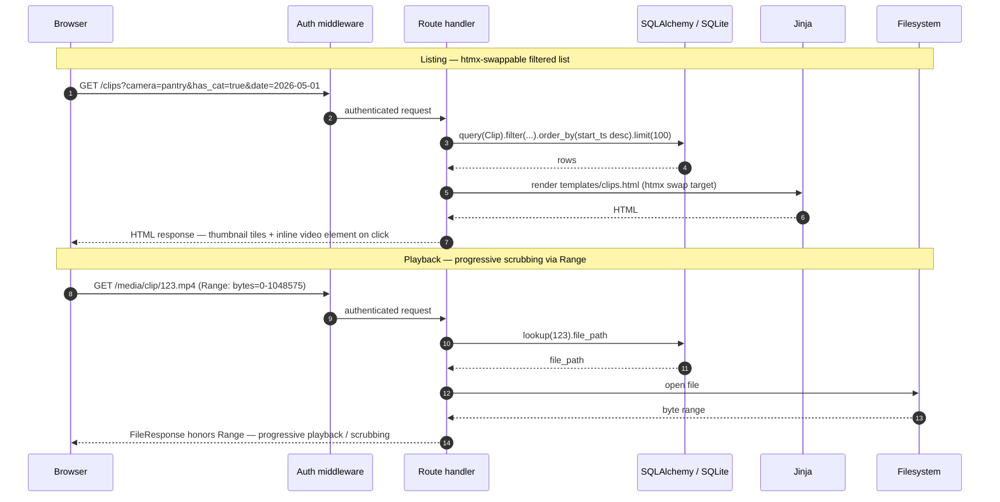

# Cat Watcher — Version 1 Design

**Date:** 2026-05-01\
**Status:** Implemented (Version 1)\
**Author:** J Rob Gant + Claude (brainstorming)

## 1. Overview

Cat Watcher monitors two Amcrest IP cameras aimed at indoor litter boxes,
ingests the motion-triggered clips they record to their SD cards, detects which
clips contain a cat, presents them in a LAN-accessible web app, and alerts the
user when activity is anomalous (silent for too long, or clustering at unusual
frequency).

The cameras' built-in web app is slow and unreliable, and SD-card recording
sometimes silently fails. This project replaces both pain points with a local
pipeline running on my home Mac mini, controlled and developed from a separate
MacBook.

### 1.1. Version 1 goals

1. Reliable ingest of motion-triggered clips from both cameras into local
   storage with metadata in SQLite.
2. Cat-vs-no-cat classification per clip (off-the-shelf model, no training
   required for version 1).
3. Web UI to browse and play recent clips, filterable by camera, date, and "has
   cat / no cat detected".
4. Two alert types delivered by email and macOS notification:
   - **Inactivity** — no cat-positive activity on **any** camera in the last 12
     hours, or poller cannot reach a camera, or a camera is recording nothing.
   - **High frequency** — at least N cat-positive clips on a camera within a
     6-hour rolling window (default N=8, configurable).
5. 30-day rolling retention matching the cameras' own retention.
6. Run unattended on the Mac mini for weeks at a time without manual
   intervention.

### 1.2. Out of scope (deferred to later phases)

- Per-cat identification (Rufus vs Marcel)
- Behavior classification (urinating vs defecating vs playing)
- Framing/coverage alert ("camera bumped, litter box not fully in frame")
- Statistical baseline frequency anomaly (mean+2σ over rolling baseline)
- Visit clustering (multiple clips for one physical visit)

The Version 1 spec is intentionally small. Each deferred feature gets its own
design + implementation cycle once the base is running.

### 1.3. Non-goals

- Sub-second-latency live monitoring. Cameras already record on motion; ingest
  happens after the fact.
- Cat-detection accuracy beyond what an off-the-shelf YOLO model provides. Some
  misses are accepted; the 12h watchdog catches operationally significant ones.
- Multi-user support. One user, one shared password.
- Internet-accessible UI.
- TLS / HTTPS for the web UI. Basic-auth credentials and clip content traverse
  the home LAN in cleartext; acceptable given the LAN-only threat model.

## 2. Hardware and constraints

| Component          | Details                                                |
| ------------------ | ------------------------------------------------------ |
| Cameras            | 2× Amcrest IP4M-1041B (4MP ProHD Indoor WiFi Pan/Tilt) |
| Camera placement   | One per litter box: "Pantry" and "Office"              |
| Camera SD cards    | 256 GB (Pantry), 128 GB (Office); 30-day rotation      |
| Camera recording   | Motion-triggered, .mp4 (H.264 in MP4 container)        |
| Production host    | Mac mini 2018, Intel Core i3 quad @ 3.6 GHz, 16 GB RAM |
| Production GPU     | Intel UHD 630 (no Neural Engine, no MPS, no CUDA)      |
| Production OS      | macOS Sequoia 15.7.5                                   |
| Production storage | External "Data" drive, 2 TB (~1.6 TB free)             |
| Development host   | MacBook (Apple Silicon), separate from production      |
| Network            | LAN only; SSH tunnel for any remote access             |
| Volume estimate    | ~20 clips/day total across both cameras, ~20s each     |

**Key constraint:** the Mac mini is x86_64. All Python wheels and any model
artifacts must be available for `macosx_*_x86_64`. Apple-Silicon-only ecosystems
(MLX, CoreML-only models) are out for production.

## 3. Architecture

Two machines, one repository:



Four LaunchAgents on the Mac mini, all in the user's session (not Daemons):

| Agent                | Type         | Cadence              | Role                                                                                                             |
| -------------------- | ------------ | -------------------- | ---------------------------------------------------------------------------------------------------------------- |
| `cat-watcher-poller` | periodic     | every 5 min          | List new clips per camera (Amcrest HTTP API), download, run cat detection, write rows to SQLite, retention sweep |
| `cat-watcher-alerts` | periodic     | every 15 min         | Evaluate inactivity + frequency + disk rules, evaluate cross-agent heartbeats, send email + macOS notification   |
| `cat-watcher-web`    | long-running | continuous           | FastAPI/uvicorn on `0.0.0.0:8000` with HTTP basic auth                                                           |
| `cat-watcher-backup` | scheduled    | daily at 03:00 local | SQLite hot-copy to `<storage_root>/backups/cat_watcher-YYYY-MM-DD.sqlite`; prunes to last 7 days                 |

All four:

- Are entry points of the same `cat_watcher` Python package
- Read/write the same SQLite DB on internal storage (WAL mode → safe concurrent
  access)
- Read/write `clips/`, `thumbs/`, and `backups/` on the external drive
- Load the same `.env` via python-dotenv at startup (no secrets in plists)

This shape gives single-responsibility processes, independent restartability,
one log file per concern, and trivial backup (one SQLite file plus one directory
tree).

## 4. Components

All components live in a single Python package `cat_watcher` with a `src/`
layout. Each LaunchAgent is `python -m cat_watcher.<entrypoint>` or the
equivalent console script wired through `[project.scripts]`.

### 4.1. `cat_watcher.config`

Pydantic-settings reads `config.toml` (path from `CAT_WATCHER_CONFIG`, default
`./config.toml`) and `.env`. Strongly typed root model with nested
`CameraConfig`, `DetectorConfig`, `AlertConfig`, `EmailConfig`, `WebConfig`.
Validates at startup; bad config exits non-zero with a precise message.

### 4.2. `cat_watcher.amcrest_client`

Wrapper over the camera HTTP API. Methods:

- `iter_recordings(since: datetime) -> Iterator[Recording]`
- `download_recording(filename: str, dest: Path) -> None`

`iter_recordings` is a **generator** that paginates lazily over the camera's
`startNum`/`endNum` API (typical Amcrest cap is 100 results per page). The
caller drives the cadence — yielding from the next page only happens when the
caller asks for the next item — so `--limit N` actually saves network
round-trips, and first-page records can flow into download/detect while
subsequent pages are still being listed. Callers that genuinely need a list can
`list(client.iter_recordings(...))`. Camera-supplied filename timestamps are
converted to UTC at this boundary (see §4.11).

`download_recording` streams chunks straight to disk
(`httpx.stream("GET", url)` + `iter_bytes()` written to a file handle on
`dest`); it never loads the full clip into memory. The same "pull, don't
accumulate" principle as `iter_recordings`, just below the public type
signature.

Implementation choice deferred to writing-plans: either the existing
`python-amcrest` package or `httpx` with manual digest auth. The local
`Amcrest-HTTP_API_V3.26.pdf` (located in docs/resources) is the reference.
Retries 3× with 10s delay for transient errors. Surfaces typed exceptions:
`CameraUnreachable`, `CameraAuthError`, `CameraAPIError`.

### 4.3. `cat_watcher.detector`

Wraps the cat-detection model. Input: path to .mp4. Output:

```python
@dataclass(frozen=True)
class DetectionResult:
    has_cat: bool
    max_score: float
    frames_sampled: int
    frames_with_cat: int
    best_box_xyxy: tuple[float, float, float, float] | None
    detector_version: str  # model name + checksum
```

Internally: ffmpeg samples N evenly-spaced frames (default 5), ultralytics
YOLOv11n runs inference on each, results aggregated. The detector interface is
pluggable so models can be swapped in version 2 without touching callers.

**License:** ultralytics is AGPL-3.0; the project repo is licensed
AGPL-3.0-or-later to match.

**Version 1 model:** `yolov11n.pt` (nano, ~6 MB) with confidence threshold 0.35.
The COCO "cat" class (id 15) is the only class checked. Model weights are
downloaded once on first run (or via a setup recipe) into
`internal_root/models/`; gitignored.

**Wheel availability note.** PyTorch dropped macOS-x86_64 wheels from PyPI
around v2.3 (early 2024); the production Mac mini is Intel x86_64. This drives
the package-manager choice in §10 — pixi sources `pytorch` (and other ML
packages) from conda-forge, which still maintains osx-64 builds. The runtime
detector code is unaffected; the constraint is purely about how dependencies are
sourced.

### 4.4. `cat_watcher.poller`

Periodic entrypoint. On startup the poller:

1. Acquires an exclusive file lock on `<internal_root>/.poller.pid`
   (`fcntl.flock` with `LOCK_EX | LOCK_NB`). If another poller process holds the
   lock — for example, a manual `pixi run poll-once` overlapping with a
   LaunchAgent tick — the new process exits cleanly with code 0. This prevents
   concurrent downloads and partial-byte races on the same files.
2. Performs the storage-availability wait (§4.13) — the poller writes to the
   external drive (`clips/`, `thumbs/`) so it cannot proceed without it.
3. Inserts a row into `agent_starts(agent_name='poller', started_at=now)`.

Then per camera, on each tick:

1. `cameras.upsert_from_config()` — keep DB row in sync with config.
2. `last = camera.last_polled_at or (now - 30 days)`.
3. `recordings = amcrest_client.iter_recordings(since=last)` (lazy generator;
   consumed by step 4 below).
4. For each recording not already in `clips` (idempotent on
   `UNIQUE(camera_id, source_filename)`):
   1. Download to `clips/<slug>/<YYYY-MM-DD>/<HHMMSS>.mp4`.
   2. ffmpeg-extract one mid-clip thumbnail to
      `thumbs/<slug>/<YYYY-MM-DD>/<HHMMSS>.jpg`.
   3. ffmpeg-sample 5 frames into memory; run detector.
   4. `fsync` both files; **only then** insert the `clips` row. This strict
      file-before-row ordering guarantees the web UI never observes a row
      pointing at a partial file.
5. Update camera state with **preservation semantics** (only overwrite when
   there is new information):
   - `cameras.last_polled_at = max(now - [poller].overlap_minutes, previous)` —
     advanced on every successful tick, but held back from `now` by
     `overlap_minutes` (default 15) so the next tick's window reaches back into
     already-covered ground. This absorbs Amcrest `findFile` indexing lag: a
     recording finalized between two ticks but not yet surfaced by `findFile` is
     still discoverable on subsequent ticks within the overlap. Duplicate ingest
     is prevented by the `UNIQUE(camera_id, source_filename)` check. The
     `max(...)` floor ensures the cursor never rewinds (defensive against clock
     skew). When `previous` is NULL (first tick), the cursor lands at
     `now - overlap_minutes`.
   - `cameras.last_clip_at = max(start_ts of new clips)` — only if clips were
     ingested this tick; otherwise preserve the previous value.
   - `cameras.last_cat_seen_at = max(start_ts where has_cat=true)` — only if any
     new clip had `has_cat=true`; otherwise preserve.
   - `cameras.poll_status` — set to `ok` if the tick succeeded; on failure, set
     the appropriate non-`ok` status (`unreachable` / `error`).
   - `cameras.poll_status_since` — set to `now` **only on the transition** from
     `ok` to non-`ok`; clear (NULL) on any transition back to `ok`; leave
     unchanged while still non-`ok`.
6. Write heartbeat row.
7. Run retention sweep — two passes:
   1. **DB-driven pass.** For each clip with `start_ts < now - 30 days`: delete
      the row inside a transaction, then unlink the clip and thumbnail files.
      Row-first ordering means a crash between the two leaves only an orphan
      file, never a dangling row pointing at a missing file.
   2. **Orphan sweep.** Scan `clips/` and `thumbs/` for files with mtime older
      than 30 days that have no matching row, and unlink them. This cleans up
      the orphans the DB-driven pass leaves behind on crash, plus any other
      stray files that may have appeared (e.g., a partially-written download
      from before the file-before-row ordering was added).

The poller swallows per-camera errors so one camera's failure does not abort the
other camera's poll.

### 4.5. `cat_watcher.alerts`

Periodic rule evaluator. On startup the alerts agent inserts a row into
`agent_starts(agent_name='alerts', started_at=now)`. The alerts agent does
**not** require the external drive to start (its state lives on internal
storage), so it skips the §4.13 storage wait and runs even when the drive is
offline — which is what lets it fire `STORAGE_UNAVAILABLE` as a normal
DB-recorded alert instead of via a marker file.

On each tick, evaluates per camera:

**Inactivity rule** — two per-camera branches plus one fleet-wide branch.

Per-camera branches (evaluated for every camera, fire with the camera's `id`):

- `cameras.last_clip_at IS NOT NULL AND now - cameras.last_clip_at > 12h` (this
  camera is producing nothing — likely the silent-SD-failure case)
- `cameras.poll_status != 'ok'` (poller cannot reach this camera — **fires
  immediately**, no time threshold; cool-down still applies so a sustained
  outage emails every 6h, not on every 15-min tick)

Fleet-wide branch (evaluated once per tick, fires with `camera_id=NULL`):

- `MAX(cameras.last_cat_seen_at) IS NOT NULL AND
  now - MAX(cameras.last_cat_seen_at) > 12h`
  (no cats seen on **any** camera for 12h+; `last_cat_seen_at` is updated
  whenever a clip with `COALESCE(manual_has_cat, has_cat)=true` is observed, so
  manual labels feed back into the watchdog). This branch is fleet-wide because
  cats don't necessarily use every litter box every day; activity on either
  camera satisfies the watchdog. The cool-down key is `(NULL, INACTIVITY)`,
  distinct from per-camera INACTIVITY cool-downs.

If `last_clip_at` is NULL on a camera the no-clips branch does not fire for that
camera. If `MAX(last_cat_seen_at) IS NULL` (no camera has ever seen a cat) the
fleet-wide no-cats branch does not fire — there is no baseline. The first
successful poll on each camera backfills the trailing 30 days of SD recordings
and populates both columns; the NULL state is therefore confined to the brief
window between install and first poll. A never-had-data anomaly past that window
is caught by direct inspection of the web UI at install time, not by an
automated alert.

Restart-after-outage requires no special handling: the first poll after a gap
backfills whatever the SD card recorded during the downtime, and the rule judges
against real data on the very next tick.

The alert body distinguishes which branch fired to indicate whether to look at
the cat, the camera, or the network.

**Frequency rule** — fires if:

- ```sql
  count(clips where camera_id=cam AND COALESCE(manual_has_cat, has_cat)=true AND start_ts > now - 6h) >= frequency_threshold_count
  ```

  (default 8)

The `COALESCE(manual_has_cat, has_cat)` form means the rule respects user
corrections — a clip you manually marked as cat-positive counts toward the
threshold; a model false-positive you marked as not-a-cat doesn't.

**Watchdog rules** (cross-agent heartbeats):

- `POLLER_STUCK` if poller heartbeat older than 15 min
- `WEB_DOWN` if web heartbeat older than 5 min
- `WEB_FLAPPING` if ≥5 rows in `agent_starts` for `agent_name='web'` within the
  last 30 min

**Storage rules** (on every alerts tick):

- `DISK_LOW` if `shutil.disk_usage(storage_root).free / total < 0.10`
  (configurable; **24h cool-down** since free-space rarely changes
  minute-to-minute). Skipped if `storage_root` is not currently mounted
  (`STORAGE_UNAVAILABLE` covers that case).
- `STORAGE_UNAVAILABLE` if the alerts agent's own write probe to `storage_root`
  fails. With the DB on internal storage, this fires as a normal DB-recorded
  alert (cool-down keys on `(NULL, STORAGE_UNAVAILABLE)` per §13). The 10-min
  startup wait in §4.13 only applies to agents that _need_ the external drive
  (poller, backup); the alerts agent does its own one-shot probe per tick.
- `BACKUP_STALE` if no file matching `backups/cat_watcher-*.sqlite` has an mtime
  within the last 36 hours. Catches silent backup failure. **24h cool-down.**
  Skipped when the most recent `alerts_sent` row for `STORAGE_UNAVAILABLE` is
  newer than `now - storage_unavailable_cooldown` (i.e., its cool-down window is
  still open) — that suppresses double-alerting on the same root cause.

Each emitted alert is recorded in `alerts_sent`. **Default cool-down: 6 hours
per (camera, alert_type) pair**, configurable via `[alerts].cooldown_hours` in
`config.toml`. Specific alert types override that default with **hard-coded**
values that live alongside their rule definitions: `WEB_FLAPPING` is 1h,
`DISK_LOW` and `BACKUP_STALE` are 24h. These overrides are intentionally not
exposed in `config.toml` — their values follow from the rule semantics (a flap
detector with a 6h cool-down would miss the next flap; a once-per-24h backup's
staleness check would fire repeatedly within a single missed run if the
cool-down were hours-scale). A second consecutive tick of the same condition
(within cool-down) does not re-fire.

The alerts agent also writes its own heartbeat. The poller checks the alerts
heartbeat and emits `ALERTS_STUCK` if older than 30 min. This provides symmetric
watchdog coverage across all three agents.

### 4.6. `cat_watcher.notifier`

Outbound senders only — no rule logic. Two functions:

- `send_email(subject: str, body: str) -> EmailResult` via Gmail SMTP+TLS with
  an app password. From: `CAT_WATCHER_GMAIL_USER`. To: comma-split
  `CAT_WATCHER_ALERT_TO_ADDRESSES`.
- `send_macos_notification(title: str, body: str) -> NotifResult` via
  `osascript -e 'display notification ...'`. Returns success/failure without
  raising.

Each return value is recorded on the `alerts_sent` row. If both fail, log
CRITICAL.

### 4.7. `cat_watcher.web`

FastAPI app. Routes:

| Method | Path                    | Purpose                                              |
| ------ | ----------------------- | ---------------------------------------------------- |
| GET    | `/`                     | Timeline view (last 24h by default) — see §4.7.1     |
| GET    | `/timeline`             | Timeline view, htmx-swappable range presets          |
| GET    | `/clips`                | Filtered list (`?camera=&has_cat=&date=`), htmx      |
| GET    | `/clips/{id}`           | Detail page with HTML5 `<video>` player + label form |
| POST   | `/clips/{id}/label`     | Set/update manual label (form: `has_cat`, `notes`)   |
| DELETE | `/clips/{id}/label`     | Clear manual label (revert to model output)          |
| GET    | `/media/clip/{id}.mp4`  | File served with `Range:` support                    |
| GET    | `/media/thumb/{id}.jpg` | Thumbnail                                            |
| GET    | `/stats`                | Daily/hourly activity charts (chart.js or similar)   |
| GET    | `/cameras`              | Per-camera health: status, last_*, recent alerts     |
| GET    | `/alerts`               | Alert history (last 30 days)                         |
| GET    | `/health`               | Liveness probe; returns latest heartbeat (read-only) |

HTTP basic auth middleware (single shared user/password from `.env`) applies to
every route except `/health` (which is read-only and useful for shell-loop
monitoring). Bind: `0.0.0.0:8000`. Templates: Jinja2. Frontend: htmx for
interactions, no JS build step. Ranged file serving via FastAPI/Starlette
`FileResponse` — required for browser scrubbing.

On startup, a FastAPI lifespan hook (a) inserts a row into `agent_starts`
(`agent_name='web', started_at=now`) and (b) spawns a background task that
writes the `web` heartbeat every 60 s. The web agent does **not** require the
external drive at startup — its DB lives on internal storage, and clip file
serving degrades gracefully (`/media/clip/{id}` returns 503 with a "storage
offline" message when the file isn't accessible). `/health` reads the latest
heartbeat without writing — only the periodic task keeps it fresh.

`/health` returns `200 OK` with JSON:

```json
{
  "status": "ok",
  "heartbeat": "2026-05-01T13:42:11Z",
  "now": "2026-05-01T13:42:54Z"
}
```

Auth is bypassed for this route so it can be polled in a `curl` loop or by an
external uptime check. If the heartbeat row is missing or stale relative to
`now`, the route still returns `200`; staleness interpretation is the alerts
agent's job, not the route's.

#### 4.7.1. Timeline view

The default landing page (`/`) and the dedicated `/timeline` route render a
chronological event timeline. Shape:

- **Per-camera horizontal lanes** — one row per camera, labeled with
  `display_name`. Sorted by name.
- **Time axis** along the bottom; default window is last 24h, with
  htmx-swappable presets (6h / 24h / 7d / 30d) and a custom date-range form.
- **Each clip = a marker** positioned at `start_ts`, width proportional to
  `duration_seconds`. Color encodes detection state:
  - green: `COALESCE(manual_has_cat, has_cat)=true`
  - gray: `COALESCE(manual_has_cat, has_cat)=false`
  - red outline: `analysis_error IS NOT NULL` (un-analyzed)
  - blue outline: `manual_has_cat IS NOT NULL` (a human has labeled this clip)
- **Hover** pops a small card with thumbnail, start/end times rendered in
  `display_timezone`, duration, max_score, and the manual-label notes if any.
- **Click** navigates to `/clips/{id}` (detail page with player + label form).
- **Alert overlays** — vertical lines spanning all lanes at each
  `alerts_sent.sent_at` within the visible window, color-coded by `alert_type`,
  with a small label tag. Lets you correlate "clips clustered right before this
  FREQUENCY alert."
- **Density bucketing** — for windows >24h, markers cluster into per-hour bins
  per lane, rendered as a heatmap-style cell with per-bin count. Restores
  per-clip markers on zoom-in.

**Implementation shape:** server-rendered SVG inline in a Jinja template;
positions computed in Python from `start_ts` relative to the visible window.
htmx swaps the timeline `<div>` on range change. A small (~50-line) vanilla JS
file handles hover preview and click navigation. No SPA framework.

### 4.8. `cat_watcher.db`

SQLAlchemy 2.0 with `DeclarativeBase`. WAL mode enabled at connection time.
Alembic migrations in `alembic/versions/`. `get_session()` context manager. No
raw SQL outside of migrations and one or two optimized aggregate queries.

### 4.9. `cat_watcher.retention`

Stand-alone function imported by the poller; sweep ordering for clips is
documented in §4.4 step 7. Also prunes:

- `agent_starts` rows older than 30 days (so the forensic "when did agent X last
  restart" query has a 30-day visibility horizon)
- `alerts_sent` rows older than 30 days (so the `/alerts` route's "last 30 days"
  claim matches the DB contents)

Idempotent; logs counts.

### 4.10. CLIs

Wired through `[project.scripts]` so LaunchAgents call simple binaries in
`.venv/bin/`:

```toml
[project.scripts]
cat-watcher = "cat_watcher.__main__:main"
cat-watcher-poller = "cat_watcher.poller:main"
cat-watcher-alerts = "cat_watcher.alerts:main"
cat-watcher-web = "cat_watcher.web.app:main"
cat-watcher-backup = "cat_watcher.backup:main"
```

Each `main()` accepts `--once` (run a single iteration and exit) and
`--config PATH` overrides for testing. The umbrella `cat-watcher` command
exposes sub-commands for ad-hoc operations (e.g.,
`cat-watcher inspect <clip-id>`).

**Config-path precedence:** `--config PATH` (CLI flag) > `CAT_WATCHER_CONFIG`
(env var) > `./config.toml` (default). The CLI flag exists primarily for tests;
LaunchAgents in production set the env var via `EnvironmentVariables` in their
plists (§11.4).

Additionally, `cat-watcher-poller --once` accepts these scoping flags for ad-hoc
fetches, first-run backfill control, and dev-cache priming:

- `--camera NAME` — restrict to one camera (default: all configured cameras)
- `--since YYYY-MM-DDTHH:MM:SS` — override per-camera `last_polled_at`
- `--until YYYY-MM-DDTHH:MM:SS` — upper bound (default: now)
- `--limit N` — cap clips downloaded this invocation
- `--no-detect` — skip detection; rows inserted with
  `analysis_error="skipped: --no-detect"`, `has_cat=false`, and the YOLO model
  is never loaded (so a fresh dev clone needs no model weights)
- `--list-only` — print what would be fetched; no downloads, no DB writes

The umbrella `cat-watcher` exposes additional sub-commands for operations and
diagnostics (no LaunchAgent invokes these — they're for human use):

- `cat-watcher inspect <clip-id>` — dump a single clip's row + file metadata.
- `cat-watcher status` — print one-screen health summary: each camera's
  `poll_status` and `last_*` timestamps, three agent heartbeats with staleness
  (poller, alerts, web — backup is reported via newest-backup mtime instead),
  `agent_starts` count in the last 24h for all four agents, last 5 alerts of
  each type. Run on the Mac mini (or via `ssh mac-mini cat-watcher status`) as
  the "is everything OK?" command.
- `cat-watcher test-cameras` — for each configured camera: exercise
  `iter_recordings(since=now-1m)` and report success / typed-exception failure;
  fetch the camera's reported clock and compare against the host clock,
  reporting drift (warn at >60 s, fail-loudly-but-don't-exit at >5 min). Run
  during install (before `pixi run install-agents`) to catch hostname /
  credential errors and clock drift immediately rather than after the first
  scheduled tick.
- `cat-watcher test-notification` — emit one synthetic alert through the full
  notifier path (email + macOS notification). Run during install so the macOS
  "send notifications" permission prompt appears at a moment you're paying
  attention to it; otherwise the prompt fires at the first real alert and is
  easy to dismiss accidentally, after which all subsequent notifications
  silently fail.
- `cat-watcher backup` — perform an immediate SQLite hot-copy (see §4.12); this
  shares its code path with the scheduled `cat-watcher-backup` LaunchAgent
  script. The umbrella form is for ad-hoc human use; the hyphenated form is what
  `launchctl` invokes.

### 4.11. Time and timezones

All datetimes are stored in the DB as **UTC** using timezone-aware Python
`datetime` objects (`datetime.now(UTC)`). Conversion to the configured local
timezone happens only at the edges:

- **Web UI rendering** uses a configurable display timezone (default
  `America/<configured>` from `config.toml`); the server formats `<time>` values
  in templates rather than relying on browser locale.
- **Alert email and macOS notification bodies** render times in the same
  configured local timezone, with the UTC offset noted in parentheses for
  unambiguous reading.
- **Camera-supplied filenames** (e.g., `06.47.04-06.48.58[M][0@0][0].mp4`) use
  the camera's configured local time. `amcrest_client` converts these at the
  ingest boundary so every datetime that flows past it is already UTC. The
  camera's clock and timezone are **verified at install time** (§4.10's
  `cat-watcher test-cameras` fetches the camera's reported clock and reports
  drift against the host) — not assumed. The exact tolerance and which API call
  to use will be settled by experimentation during implementation; until
  measured, the spec's commitment is "verified, not assumed."

This rule keeps the 12-hour inactivity watchdog and 6-hour rolling frequency
window correct across DST transitions; UTC arithmetic has no spring/fall
discontinuities. Camera-clock drift between install-time verifications is a
known risk: a camera that drifts hours into the future would file clips with
future `start_ts` values and skew both watchdog and frequency rules. A periodic
drift re-check (e.g., on every Nth poll tick) is a candidate for version-2
hardening; version 1 relies on the install-time check plus manual re-runs of
`cat-watcher test-cameras` during operations.

### 4.12. `cat_watcher.backup`

Daily SQLite hot-copy of `<internal_root>/cat_watcher.sqlite` to
`<storage_root>/backups/cat_watcher-YYYY-MM-DD.sqlite` using SQLite's online
backup API (`sqlite3.Connection.backup()`), which is safe under WAL mode without
blocking writers. Retains the last 7 daily backups; older ones are pruned by
file mtime.

The cross-volume direction is intentional: the DB lives on internal storage, the
backup lives on the external drive. If the internal SSD fails, the most recent
backup is intact on the external drive. If the external drive fails, the live DB
on internal storage is intact (and the next successful backup restores
`backups/`). Either single-drive failure is recoverable.

**Same-drive failure caveat:** if both drives fail simultaneously (fire, theft,
lightning), nothing survives. Off-host backup (cloud / NAS / second external) is
version-2 territory.

Clips and thumbnails are **not** backed up here — they're large, the cameras' SD
cards are the canonical source for the trailing 30 days, and a separate
version-2 design will tackle off-host backup if needed. The DB is the only piece
of state that doesn't exist anywhere else (manual labels, alerts history, camera
runtime state).

On startup the backup agent (a) performs the §4.13 storage-availability wait (it
needs the external drive to write the backup), (b) inserts a row into
`agent_starts(agent_name='backup', started_at=now)`, then (c) performs the
backup + prune.

Runs as a 4th LaunchAgent: `cat-watcher-backup`, scheduled
`StartCalendarInterval` at 03:00 local time. The `cat-watcher backup` umbrella
sub-command runs the same code path on demand.

The backup agent does **not** participate in the heartbeat watchdog scheme — a
once-daily process would always look stale. Instead, the alerts agent checks for
`BACKUP_STALE` (§4.5) by inspecting the mtime of the newest file in `backups/`.
Filesystem state, not heartbeat state.

### 4.13. Storage-availability handling

The Mac mini production storage lives on an external encrypted drive that
requires the user to manually enter a password to unlock — it does **not**
auto-mount at login. The flow is: user logs in → LaunchAgents start → drive is
still locked → user manually enters the password → drive becomes accessible.
Several minutes can pass between login and unlock, especially if the user logs
in remotely or doesn't sit down at the Mac mini right away. Agents that need the
external drive must therefore be patient on startup.

The drive can also be offline entirely (cable unplugged, drive failure, or user
dismissed the unlock prompt) — that's the case where waiting forever would just
mask the real problem.

**Which agents need the external drive at startup:**

| Agent    | Needs external drive?            | Behavior on missing drive                                      |
| -------- | -------------------------------- | -------------------------------------------------------------- |
| `poller` | Yes (writes `clips/`, `thumbs/`) | Waits up to 10 min on startup, then exits                      |
| `backup` | Yes (writes `backups/`)          | Waits up to 10 min on startup, then exits                      |
| `alerts` | No (state is on internal)        | Runs normally; fires `STORAGE_UNAVAILABLE` per tick            |
| `web`    | No (DB on internal)              | Runs normally; UI works; `/media/{clip,thumb}/{id}` return 503 |

**At startup, agents that require external storage** (`poller`, `backup`) do:

1. Check `storage_root.exists() and storage_root.is_dir()` and that a write
   probe (`tempfile.NamedTemporaryFile(dir=storage_root)`) succeeds.
2. If yes, ensure the canonical external subfolder structure exists by calling
   `ensure_storage_layout()` — a shared helper in `cat_watcher.storage` that
   idempotently creates `clips/`, `thumbs/`, `backups/` under `storage_root` if
   any are missing. Then proceed normally.
3. If no, retry every 10 s for up to 10 minutes total. This window is sized to
   cover a typical "I just logged in and haven't unlocked the drive yet" gap.
4. If still unavailable after 10 min: log CRITICAL and exit non-zero.
   LaunchAgent's `KeepAlive` (none for these — they're periodic) or next
   `StartInterval` retries. The alerts agent (which is unaffected) fires the
   user-visible `STORAGE_UNAVAILABLE` alert via the normal DB-backed path on its
   own tick — no special marker-file workaround needed.

**`internal_root` and `storage_root` initialization:** the app's
`ensure_storage_layout()` helper idempotently creates the canonical subfolders
under each root (`models/` and `logs/` under `internal_root`; `clips/`,
`thumbs/`, `backups/` under `storage_root`). It does **not** auto-create the
roots themselves — the operator does that, so a config typo fails loudly rather
than silently materializing a wrong directory.

`internal_root` is always available (it's on the always-mounted internal drive),
so the alerts and web agents can write to the DB and serve the UI even when the
external drive is offline.

**Web UI degradation during outage.** The timeline view (§4.7.1) renders inline
`` thumbnails sourced from `/media/thumb/{id}`. When storage is offline,
those routes return 503 and browsers show the standard broken-image icon per
cell. Templates render a small static placeholder (a single bundled SVG) via an
`onerror` handler so the timeline still reads as a structured event list rather
than a wall of broken-image glyphs. The server-side template also surfaces a
thin banner — "External storage offline — clip playback and thumbnails
unavailable" — sourced from a one-shot probe in the request handler so users
aren't left guessing why media isn't loading.

### 4.14. Alert message templates

Each alert type renders a deterministic subject and body. Email subjects are
short; bodies are plain text. macOS notifications reuse the email subject as the
title with a single-line summary as the message (truncated to ~120 chars). All
timestamps render in `web.display_timezone` (default `America/New_York`) with
the UTC offset noted parenthetically; relative times ("14m ago") are computed at
render time.

#### INACTIVITY (per-camera branches)

```text
Subject: [cat-watcher] INACTIVITY: Pantry Litter Box Camera

Branch:         no clips received
Last poll:      2026-05-01 09:42:11 EDT (-04:00) — 12m ago
Last clip:      2026-04-30 21:33:08 EDT (-04:00) — 14h 18m ago
Last cat seen:  2026-04-30 21:33:08 EDT (-04:00) — 14h 18m ago
Poll status:    ok
Web UI:         {web.public_url}
```

The "Branch" line names which per-camera inactivity sub-condition tripped:
`no clips received` or `camera unreachable since {timestamp}` (using
`poll_status_since` for the unreachable-since timestamp).

#### INACTIVITY (fleet-wide no-cats branch)

```text
Subject: [cat-watcher] INACTIVITY: no cats seen on any camera

Branch:         no cats seen on any camera
Last cat seen:  2026-04-30 21:33:08 EDT (-04:00) — 14h 18m ago (Pantry Litter Box Camera)
Threshold:      12h
Web UI:         {web.public_url}
```

The fleet-wide branch fires once with `camera_id=NULL` when no camera has
recorded a cat-positive clip within the threshold. The "Last cat seen" line
identifies which camera was the most recent to see one (so the operator knows
where to start looking when activity resumes).

#### FREQUENCY

```text
Subject: [cat-watcher] FREQUENCY: Pantry Litter Box Camera (12 in 6h)

Camera:                          Pantry Litter Box Camera
Cat-positive clips in last 6h:   12
Threshold:                       8
First in window:                 2026-05-01 04:45:00 EDT (-04:00)
Latest:                          2026-05-01 09:58:11 EDT (-04:00)
Web UI:                          {web.public_url}
```

#### POLLER_STUCK / WEB_DOWN / ALERTS_STUCK

```text
Subject: [cat-watcher] {ALERT_TYPE}

Agent:           {agent_name}            # poller / web / alerts
Last heartbeat:  2026-05-01 09:42:11 EDT (-04:00) — 14m ago
Web UI:          {web.public_url}
```

#### WEB_FLAPPING

```text
Subject: [cat-watcher] WEB_FLAPPING (6 restarts in last 30m)

Agent:                  web
Restarts in last 30m:   6
First in window:        2026-05-01 09:14:33 EDT (-04:00)
Most recent:            2026-05-01 09:41:02 EDT (-04:00)
Web UI:                 {web.public_url}

--- Last 50 lines of web.stderr.log ---
<tail>
```

#### DISK_LOW

```text
Subject: [cat-watcher] DISK_LOW (8.2% free on /Volumes/Data)

Mount:           /Volumes/Data
Free:            164 GB / 2 TB (8.2%)
Threshold:       10%
Web UI:          {web.public_url}
```

#### STORAGE_UNAVAILABLE

```text
Subject: [cat-watcher] STORAGE_UNAVAILABLE (external drive not mounted)

storage_root:  /Volumes/Data/cat-watcher
First detected: 2026-05-01 09:42:11 EDT (-04:00) — 14m ago
Probable cause: external drive not unlocked yet, disconnected, or unlock dismissed
Affected:      poller (cannot ingest new clips), backup (cannot write nightly backup)
Unaffected:    alerts (this email), web UI (DB on internal storage)
```

Fired by the alerts agent on its tick when its own write probe to `storage_root`
fails. Recorded in `alerts_sent` like any other alert (the DB lives on internal
storage, so the standard cool-down machinery applies).

#### BACKUP_STALE

```text
Subject: [cat-watcher] BACKUP_STALE (no backup in 38h)

Newest backup:  cat_watcher-2026-04-29.sqlite
Mtime:          2026-04-29 03:00:14 EDT (-04:00) — 38h 42m ago
Threshold:      36h
Storage root:   /Volumes/Data/cat-watcher (mounted: yes)
```

Indicates the backup LaunchAgent has been failing or was skipped. Check
`backup.stderr.log` for the cause.

## 5. Data flow

### 5.1. Ingest path (every 5 min, per camera)



### 5.2. Alert path (every 15 min)



In parallel, the poller checks the `alerts` heartbeat on its own tick: if it is
stale by more than 30 min, the poller fires `ALERTS_STUCK` via the same notifier
code path.

### 5.3. Web request lifecycle



## 6. Storage layout

### 6.1. Filesystem (Mac mini production)

Production splits state across two roots: small-and-irreplaceable on internal
storage, large-and-bulky on the external drive. Backups bridge the two —
DB-from-internal is hot-copied to external for cross-volume redundancy.

**`internal_root` (default `~/Library/Application Support/cat-watcher`):**

```text
~/Library/Application Support/cat-watcher/
├── .poller.pid                    # exclusive lock file (see §4.4)
├── cat_watcher.sqlite             # main DB (WAL also: -wal, -shm)
├── models/
│   └── yolov11n.pt
└── logs/
    ├── poller.log                 # Python RotatingFileHandler
    ├── poller.stdout.log          # LaunchAgent StandardOutPath (panic-before-init)
    ├── poller.stderr.log          # LaunchAgent StandardErrorPath
    ├── alerts.log
    ├── alerts.stdout.log
    ├── alerts.stderr.log
    ├── web.log
    ├── web.stdout.log
    ├── web.stderr.log
    ├── backup.log
    ├── backup.stdout.log
    └── backup.stderr.log
```

**`storage_root` (default `/Volumes/Data/cat-watcher`):**

```text
/Volumes/Data/cat-watcher/
├── clips/
│   ├── pantry/2026-05-01/064704.mp4
│   └── office/2026-05-01/071210.mp4
├── thumbs/
│   ├── pantry/2026-05-01/064704.jpg
│   └── office/2026-05-01/071210.jpg
└── backups/
    └── cat_watcher-2026-05-01.sqlite  # nightly hot-copy of DB; last 7 retained (§4.12)
```

On the **MacBook (dev)** both `internal_root` and `storage_root` default to
`./data/` (gitignored), so dev sees a single combined tree without the prod
split.

Date-based subdirectories keep `ls` usable and let the retention sweep delete
entire date directories at once.

### 6.2. Database schema

WAL mode on. Foreign keys on (`PRAGMA foreign_keys = ON`).

#### `cameras`

| col                 | type       | notes                                                                      |
| ------------------- | ---------- | -------------------------------------------------------------------------- |
| `id`                | int PK     |                                                                            |
| `name`              | str unique | slug from config (`pantry`, `office`)                                      |
| `display_name`      | str        | "Pantry Litter Box Camera" — for UI                                        |
| `host`              | str        | from config                                                                |
| `last_polled_at`    | datetime?  | last successful poll attempt                                               |
| `last_clip_at`      | datetime?  | most recent clip ingested                                                  |
| `last_cat_seen_at`  | datetime?  | most recent cat-positive clip                                              |
| `poll_status`       | enum       | `ok` / `unreachable` / `error`                                             |
| `poll_status_since` | datetime?  | when status last transitioned away from `ok`; NULL when `poll_status='ok'` |
| `poll_error`        | str?       | last error message (truncated to 500 chars)                                |

#### `clips`

| col                  | type      | notes                                              |
| -------------------- | --------- | -------------------------------------------------- |
| `id`                 | int PK    |                                                    |
| `camera_id`          | int FK    |                                                    |
| `source_filename`    | str       | original filename on camera                        |
| `start_ts`           | datetime  |                                                    |
| `end_ts`             | datetime  |                                                    |
| `duration_seconds`   | float     |                                                    |
| `file_path`          | str       | relative to `storage_root`                         |
| `thumb_path`         | str       | relative to `storage_root`                         |
| `file_size_bytes`    | int       |                                                    |
| `has_cat`            | bool      |                                                    |
| `max_score`          | float     | top confidence across sampled frames               |
| `frames_sampled`     | int       |                                                    |
| `frames_with_cat`    | int       |                                                    |
| `best_box_xyxy`      | JSON?     | for future use (version-2 ROI overlap)             |
| `detector_version`   | str       | model name + sha256 of weights                     |
| `ingested_at`        | datetime  |                                                    |
| `analysis_error`     | str?      | if ffmpeg/detector failed; clip kept un-analyzed   |
| `manual_has_cat`     | bool?     | user correction; NULL = no manual label applied    |
| `manual_label_at`    | datetime? | when the manual label was applied                  |
| `manual_label_notes` | str?      | optional notes (e.g., "Rufus", "ear visible only") |

Constraints / indices:

- `UNIQUE (camera_id, source_filename)` — drives idempotency
- index on `(camera_id, start_ts)` — list views
- index on `(camera_id, has_cat, start_ts)` — frequency queries

#### `alerts_sent`

| col              | type     | notes                                                                                                                                                                         |
| ---------------- | -------- | ----------------------------------------------------------------------------------------------------------------------------------------------------------------------------- |
| `id`             | int PK   |                                                                                                                                                                               |
| `alert_type`     | enum     | `INACTIVITY` / `FREQUENCY` / `POLLER_STUCK` / `POLLER_EMPTY_AFTER_QUIET` / `WEB_DOWN` / `WEB_FLAPPING` / `ALERTS_STUCK` / `DISK_LOW` / `STORAGE_UNAVAILABLE` / `BACKUP_STALE` |
| `camera_id`      | int? FK  | null for non-camera alerts                                                                                                                                                    |
| `sent_at`        | datetime |                                                                                                                                                                               |
| `subject`        | str      | rendered subject line (see §4.14)                                                                                                                                             |
| `body`           | str      | rendered body                                                                                                                                                                 |
| `email_ok`       | bool     |                                                                                                                                                                               |
| `macos_ok`       | bool     |                                                                                                                                                                               |
| `delivery_error` | str?     | if any sender failed                                                                                                                                                          |

Index on `(camera_id, alert_type, sent_at)` for cool-down lookups.

#### `heartbeats`

| col            | type     | notes                       |
| -------------- | -------- | --------------------------- |
| `agent_name`   | str PK   | `poller` / `alerts` / `web` |
| `last_seen_at` | datetime |                             |

Three rows total; written on every agent tick. The `backup` agent is
intentionally **not** in this scheme — its once-daily cadence would always look
stale to the alerts watchdog. Backup health is monitored via the `BACKUP_STALE`
rule (§4.5), which inspects `backups/` mtimes instead.

#### `agent_starts`

| col          | type     | notes                                  |
| ------------ | -------- | -------------------------------------- |
| `id`         | int PK   |                                        |
| `agent_name` | str      | `poller` / `alerts` / `web` / `backup` |
| `started_at` | datetime |                                        |

Index on `(agent_name, started_at)`. Pruned to 30 days by the retention sweep
(§4.9), matching the rest of the retention window. Used for `WEB_FLAPPING`
detection (§4.5) and for forensic "when did this agent last restart" queries in
the UI.

### 6.3. Migrations

Alembic with autogenerate from day one. `pixi run db-revision "..."`,
`pixi run db-upgrade`, `pixi run db-downgrade`. Migration tests verify
`upgrade head` followed by `downgrade base` round-trips cleanly.

## 7. Configuration and secrets

Two-file split: shape-of-deployment in `config.toml` (gitignored, with
`config.example.toml` tracked); all credentials and PII in `.env` (gitignored,
with `.env.example` tracked).

### 7.1. `config.toml`

The example below is the dev-friendly default. Both storage roots default to
`./data` for dev so a fresh clone works immediately. In prod on the Mac mini,
override:

| Field           | Dev default | Prod value                                  |
| --------------- | ----------- | ------------------------------------------- |
| `internal_root` | `./data`    | `~/Library/Application Support/cat-watcher` |
| `storage_root`  | `./data`    | `/Volumes/Data/cat-watcher`                 |

Relative paths resolve to the running process's cwd (the LaunchAgent's
`WorkingDirectory` in prod, the repo root in dev). See §6.1 for what each root
contains and why the split exists.

```toml
internal_root = "./data" # DB, locks, models, logs
storage_root = "./data" # clips, thumbs, backups
log_level = "INFO"

[[cameras]]
name = "pantry"
display_name = "Pantry Litter Box Camera"
host = "<pantry.example.com>"
port = 80
# username + password from env: CAT_WATCHER_PANTRY_{USERNAME,PASSWORD}

[[cameras]]
name = "office"
display_name = "Office Litter Box Camera"
host = "<office.example.com>"
port = 80
# username + password from env: CAT_WATCHER_OFFICE_{USERNAME,PASSWORD}

[detector]
model = "yolov11n.pt"
confidence_threshold = 0.35
frames_to_sample = 5

[alerts]
inactivity_hours = 12
frequency_window_hours = 6
frequency_threshold_count = 8
cooldown_hours = 6

[alerts.email]
enabled = true
smtp_host = "smtp.gmail.com"
smtp_port = 587

[alerts.macos]
enabled = true

[web]
host = "0.0.0.0"
port = 8000
heartbeat_interval_seconds = 60
public_url = "http://mac-mini.local:8000" # used in alert email bodies
display_timezone = "America/New_York" # used in UI + alert rendering
```

### 7.2. `.env`

```bash
CAT_WATCHER_PANTRY_USERNAME=
CAT_WATCHER_PANTRY_PASSWORD=
CAT_WATCHER_OFFICE_USERNAME=
CAT_WATCHER_OFFICE_PASSWORD=
CAT_WATCHER_GMAIL_USER=
CAT_WATCHER_GMAIL_APP_PASSWORD=
CAT_WATCHER_ALERT_TO_ADDRESSES=  # comma-separated
CAT_WATCHER_WEB_USERNAME=
CAT_WATCHER_WEB_PASSWORD=
```

### 7.3. Loading

`cat_watcher.config` uses pydantic-settings. TOML path from `CAT_WATCHER_CONFIG`
env (default `./config.toml`). `.env` is auto-loaded by python-dotenv at startup
— same code path in dev and production. LaunchAgent plists do not embed secrets.
Passwords are rotated by editing `.env` and `launchctl kickstart -k`.

### 7.4. Public-repo safety

A public clone contains zero credentials, zero hostnames, zero email addresses.
Pre-commit hooks (Section 10) reject any committed binary, video, image, or
model file outside `tests/fixtures/`, plus run `detect-secrets` against text
content.

## 8. Error handling and supervision

Two principles: **fail loud, never silently swallow** (silent failures are
exactly the problem this project solves); **transient errors retry, persistent
errors surface as alerts**.

### 8.1. Per-failure-mode behavior

| Failure                          | Where                     | Behavior                                                                                                                                                                                                                                                                                                                            |
| -------------------------------- | ------------------------- | ----------------------------------------------------------------------------------------------------------------------------------------------------------------------------------------------------------------------------------------------------------------------------------------------------------------------------------- |
| Camera HTTP unreachable          | `amcrest_client`          | Retry 3× with 10s delay. After exhaustion: raise `CameraUnreachable`. Poller catches, sets `cameras.poll_status='unreachable'`, logs WARNING. Other camera's poll continues. 12h watchdog escalates to email.                                                                                                                       |
| Camera HTTP 4xx (auth, bad path) | `amcrest_client`          | No retry — config issue. Raise typed exception. Poller catches, sets `poll_status='error'` with message. Same watchdog escalation.                                                                                                                                                                                                  |
| Single clip download fails       | `amcrest_client` + poller | `amcrest_client` retries 3× with 10s delay (the same policy described in §4.2 — it applies to both `iter_recordings` and `download_recording`). After exhaustion: poller logs ERROR, skips this clip, continues with the others. The next tick's `iter_recordings` re-yields the same recording and the download retries naturally. |
| ffmpeg failure                   | poller                    | Log ERROR with stderr. Skip thumbnail/detection. Insert clip row with `analysis_error` set; UI surfaces these in a separate filter.                                                                                                                                                                                                 |
| Detector exception               | poller                    | Same as ffmpeg failure — keep the clip, mark un-analyzed.                                                                                                                                                                                                                                                                           |
| SQLite locked / disk full        | poller                    | CRITICAL log; LaunchAgent re-runs on next interval. Disk-full surfaces via the watchdog or the UI when it can't render.                                                                                                                                                                                                             |
| Email send fails                 | notifier                  | Log ERROR. Record `email_ok=false`. macOS notification still attempts.                                                                                                                                                                                                                                                              |
| macOS notification fails         | notifier                  | Same — record `macos_ok=false`. Don't block email.                                                                                                                                                                                                                                                                                  |
| Web request handler exception    | FastAPI                   | Standard exception middleware: full traceback to log; generic 500 page (no stack-trace leak).                                                                                                                                                                                                                                       |
| Auth failure on web              | FastAPI                   | 401 with `WWW-Authenticate`. ≥5 failures from same IP within 5 min: log WARNING. No lockout (LAN-only).                                                                                                                                                                                                                             |

### 8.2. LaunchAgent supervision

For `cat-watcher-web` (long-running):

```xml
<key>KeepAlive</key>
<dict>
  <key>SuccessfulExit</key>
  <false />
  <!-- restart only on non-zero exit -->
</dict>
<key>ThrottleInterval</key>
<integer>30</integer>
<!-- min 30 s between launches -->
```

For `cat-watcher-poller` and `cat-watcher-alerts` (periodic):

```xml
<key>StartInterval</key>
<integer>300</integer>
<!-- or 900 for alerts -->
<!-- no KeepAlive: failures recover on next tick -->
```

### 8.3. Cross-agent watchdog (heartbeat-based)

| Heartbeat | Written by                       | Checked by        | Stale threshold | Alert          |
| --------- | -------------------------------- | ----------------- | --------------- | -------------- |
| `poller`  | poller every tick                | alerts every tick | 15 min          | `POLLER_STUCK` |
| `web`     | web every 60 s (background task) | alerts every tick | 5 min           | `WEB_DOWN`     |
| `alerts`  | alerts every tick                | poller every tick | 30 min          | `ALERTS_STUCK` |

**Web flap detection:** alerts agent counts rows in `agent_starts` where
`agent_name='web' AND started_at > now - 30min`; ≥5 rows → `WEB_FLAPPING` with
the last 50 lines of `web.stderr.log` in the body. 1-hour cool-down on this
alert specifically.

### 8.4. Logs

Python `RotatingFileHandler` per agent: 10 MB × 5 files. LaunchAgent
`StandardOutPath` and `StandardErrorPath` capture anything that escapes Python's
logger.

### 8.5. What explicitly NOT to do

- No bare `except: pass`. Every caught exception retries, escalates, or is
  logged at WARNING+.
- No silent degraded mode. If detection fails, the clip is marked un-analyzed in
  the UI — never given a default `has_cat` value.
- No clever auto-recovery on persistent errors. Wrong password is not "tried
  with the old password". Config is config.

## 9. Testing strategy

Per CLAUDE.md guidance: prefer real implementations, mock only at boundaries not
owned by this project, assert on behavior and state.

### 9.1. Layout

```text
tests/
├── conftest.py
├── unit/
│   ├── test_config.py
│   ├── test_amcrest_client.py
│   ├── test_detector.py
│   ├── test_alerts.py
│   ├── test_notifier.py
│   ├── test_poller.py
│   └── test_retention.py
├── integration/
│   ├── test_poller_end_to_end.py     # mocked HTTP; real ffmpeg + model + DB
│   ├── test_web.py                   # FastAPI TestClient + real DB
│   └── test_migrations.py            # Alembic round-trip
└── fixtures/
    ├── cat_image.jpg                 # one ~30 KB public-domain JPEG, committed
    ├── make_clip.py                  # builds synthetic .mp4 from cat_image.jpg
    └── generated/                    # gitignored — built at session start
```

### 9.2. Test doubles

**External boundaries (mock):**

| Boundary         | Approach                                                                                                                                                         |
| ---------------- | ---------------------------------------------------------------------------------------------------------------------------------------------------------------- |
| Amcrest HTTP API | `respx` / `httpx.MockTransport` for unit tests                                                                                                                   |
| SMTP             | `aiosmtpd` real local server for integration; `unittest.mock.patch('smtplib.SMTP')` for unit                                                                     |
| `osascript`      | `subprocess.run` patched. One Darwin-only integration test exercises real subprocess.                                                                            |
| YOLO model       | `unittest.mock.patch('ultralytics.YOLO')` returning canned `Results` for unit tests. One integration test runs the **real** model on the synthetic fixture clip. |

**Internal boundaries (real, never mocked):**

- Database (`tmp_path`-backed SQLite + Alembic migrations on each test)
- Filesystem (`tmp_path`)
- Internal `cat_watcher.*` modules

A test that needs to mock another `cat_watcher.*` module signals a missing seam
in the production code; the production code is refactored rather than the test
reaching for a mock.

### 9.3. Fixtures

The committed `tests/fixtures/cat_image.jpg` is a single small public-domain
photo (selected during implementation; attribution in `LICENSES.md`). At test
session start, `make_clip.py` runs ffmpeg to build a few seconds of synthetic
.mp4 from that still — same H.264/MP4 the cameras produce. Output to
`tests/fixtures/generated/` (gitignored). Total committed fixture size: ~30 KB.

The test pipeline never uses real camera footage — tests must remain
reproducible from a clean clone with no network access. For ad-hoc development
and exploration, `pixi run fetch-clips` populates `data/clips/` from real
cameras; those files are gitignored and are not referenced from any test.

### 9.4. Critical paths with explicit tests

1. **Poller idempotency** — running twice with same recordings yields same DB
   state.
2. **Inactivity rule** — synthetic DB scenarios for each of the three branches.
3. **Frequency rule** — the "17 visits in 5 hours" scenario passes.
4. **Cool-down** — second consecutive tick of same condition does not re-fire.
5. **Watchdog cross-checks** — stale heartbeats trigger the right alert types.
6. **Auth** — unauthenticated requests get 401, authenticated 200.
7. **Range-request playback** — `Range:` header honored on
   `/media/clip/{id}.mp4`.
8. **Migration round-trip** — `upgrade head; downgrade base` is clean.
9. **Retention** — files older than 30 days are removed; younger ones retained;
   rows match.
10. **Pidfile concurrency** — second poller invocation while the first is still
    running exits cleanly with code 0; no duplicate downloads, no DB write
    conflicts.

### 9.5. CI

- **Primary gate:** `pixi run test-on-mini` — ssh to Mac mini, pull,
  `pixi install`, `pixi run pytest`. Truth is what runs on the deploy target.
- **Nice-to-have:** GitHub Actions on `ubuntu-latest` running ruff +
  basedpyright + mypy + pylint + pytest under pixi.
- **Workflow security:** all third-party actions pinned to commit SHAs (Renovate
  or Dependabot keeps them current). Minimal `permissions:` per workflow.
  `actionlint` and `zizmor` run on every change to `.github/workflows/`.

`coverage.fail_under = 90` per project standard.

## 10. Repo and tooling

Managed by [pixi](https://pixi.sh) — a conda+PyPI hybrid package manager that
sources native-extension wheels from conda-forge while still supporting
PyPI-only packages. This is the only workable choice for the prod target: the
2018 Intel Mac mini cannot install PyTorch (and several other ML packages) from
PyPI, because PyPI dropped macOS-x86_64 wheels for them around 2024. conda-forge
maintains osx-64 builds.

Dependencies are managed exclusively through the pixi CLI (`pixi add`,
`pixi add --feature <name>`, `pixi remove`) — never edit `pyproject.toml`'s
`[tool.pixi.*]` blocks by hand.

### 10.1. Repo layout

```text
cat-watcher/
├── .editorconfig
├── .env.example
├── .gitattributes
├── .github/
│   └── workflows/
│       └── ci.yml                # ruff/typecheckers/pytest + actionlint/zizmor on Linux
├── .gitignore
├── .markdownlint.jsonc
├── .markdownlintignore
├── Brewfile
├── LICENSE                       # AGPL-3.0
├── LICENSES.md                   # third-party attribution (cat photo, ultralytics, etc.)
├── README.md
├── alembic.ini
├── alembic/
│   ├── env.py
│   └── versions/
├── config.example.toml
├── docs/
│   ├── resources/
│   │   └── Amcrest-HTTP_API_V3.26.pdf  # vendored camera-API reference (9 MB)
│   └── specs/
│       └── 2026-05-01-cat-watcher-design.md
├── dprint.jsonc
├── pyproject.toml                # also hosts [tool.pixi.*] config + tasks (§10.3, §10.4)
├── scripts/
│   ├── install_launchagents.sh
│   ├── uninstall_launchagents.sh
│   └── plists/
│       ├── com.robgant.cat-watcher.poller.plist.template
│       ├── com.robgant.cat-watcher.alerts.plist.template
│       ├── com.robgant.cat-watcher.web.plist.template
│       └── com.robgant.cat-watcher.backup.plist.template
├── src/
│   └── cat_watcher/
│       ├── __init__.py
│       ├── __main__.py
│       ├── alerts.py
│       ├── amcrest_client.py
│       ├── backup.py
│       ├── config.py
│       ├── db.py
│       ├── detector.py
│       ├── notifier.py
│       ├── poller.py
│       ├── retention.py
│       ├── storage.py             # ensure_storage_layout, drive-availability helpers (§4.13)
│       └── web/
│           ├── __init__.py
│           ├── app.py
│           ├── auth.py
│           ├── routes.py
│           ├── static/
│           └── templates/
└── tests/                        # see Section 9
```

### 10.2. Inherited tooling baseline

Adopted verbatim from the project's tooling conventions (with version bumps
where appropriate at bootstrap):

- `.editorconfig` — 2-space default, 4-space Python, 140 line limit, 80 for
  `.md`, LF
- `.gitattributes` — comprehensive line-ending and binary classification
- `dprint.jsonc` — same plugin set
- `.markdownlint.jsonc` + `.markdownlintignore`
- `pyproject.toml` shape — all `[tool.*]` lint / type / test / coverage blocks
  (ruff `select=["ALL"]` with the same minimal ignores, pylint dedupe block,
  mypy `strict=true`, basedpyright execution-environment for tests,
  pyproject-fmt config, pytest `filterwarnings=["error"]` +
  `--strict-markers --strict-config --tb=short`, coverage `branch=true` and
  `fail_under=90`). Two structural changes from the reference template:
  - `[build-system]` switches from `uv_build` to `hatchling.build`
    (`requires = ["hatchling"]`). Hatchling is the default that
    `pixi init --format pyproject` produces and is the conventional choice for
    pixi-managed Python projects; no behavioral change vs. uv_build.
  - Dependency lists move out of `[project].dependencies` /
    `[dependency-groups]` and into `[tool.pixi.*]` blocks (§10.3).

### 10.3. Tooling adjustments for this project

The pixi-managed `pyproject.toml` is bootstrapped with
`pixi init --format pyproject` (which produces `[project]`, `[build-system]`
with `hatchling.build`, `[tool.pixi.workspace]`, and an empty
`[tool.pixi.tasks]`). The project-specific blocks below are layered on top of
that skeleton; hand-editing of `[tool.pixi.*]` blocks is forbidden after
bootstrap (§10 preamble).

- **`.gitattributes`** — append `*.mp4 binary`, `*.dav binary`, `*.pt binary`,
  `*.onnx binary`.
- **`.gitignore`** — append cat-watcher additions:

  ```gitignore
  # cat-watcher local data
  data/
  config.toml
  .env

  # pixi-managed environment (per-machine, not committed)
  .pixi/

  # Local model cache and trained weights
  models/
  *.pt
  *.onnx

  # Local SQLite (WAL/SHM not in template)
  *.sqlite-wal
  *.sqlite-shm
  ```

- **`Brewfile`** — keeps the development tools that aren't Python-managed:
  `shellcheck`, `dprint`, `markdownlint-cli`, `shfmt`, `actionlint`, `zizmor`,
  `ffmpeg`, `git`, and `pixi` itself. `uv` and `just` are gone (both replaced by
  pixi — pixi handles package management _and_ serves as the task runner via
  `[tool.pixi.tasks]`).
- **Python version source-of-truth.** Python version is specified once, in
  `[tool.pixi.dependencies].python` (`python = "3.14.*"`). The repo
  intentionally does **not** ship a `.python-version` file — pixi resolves the
  interpreter from its own dependency table, and a stray `.python-version` would
  only invite confusion about which file is authoritative.
- **`pyproject.toml`** — `name = "cat-watcher"`, `requires-python = ">=3.14"`,
  `[project.scripts]` for the five CLIs (`cat-watcher`, `cat-watcher-poller`,
  `cat-watcher-alerts`, `cat-watcher-web`, `cat-watcher-backup`).
- **`[tool.pixi.workspace]`** — `channels = ["conda-forge"]`,
  `platforms = ["osx-arm64", "osx-64", "linux-64"]` (Apple Silicon dev,
  Intel-Mac prod, Linux CI).
- **`[tool.pixi.dependencies]`** (conda-forge): `python = "3.14.*"`, `pytorch`,
  `ultralytics`, `opencv`, `numpy`, `pillow`, `ffmpeg`. These are the packages
  whose macOS-x86_64 wheels exist on conda-forge but not on PyPI; conda-forge is
  the only working source for prod.
- **`[tool.pixi.pypi-dependencies]`** (PyPI): `fastapi`, `uvicorn[standard]`,
  `jinja2`, `sqlalchemy>=2`, `alembic`, `httpx`, `pydantic-settings`,
  `python-dotenv`, plus `cat-watcher = { path = ".", editable = true }` so the
  package itself is installed in editable mode for `pixi run pytest`.
- **`[tool.pixi.feature.dev.dependencies]`** (conda-forge): `pytest`,
  `pytest-cov`, `pytest-mock`, `pytest-randomly`, `respx`, `aiosmtpd`, `ruff`,
  `basedpyright`, `mypy`, `pylint`, `pyproject-fmt`.
- **`[tool.pixi.feature.dev.pypi-dependencies]`**: `pylint-pytest>=2.0.0a1`
  (pre-release pin required for current pylint + Python 3.14; conda-forge
  doesn't carry the pre-release), `pylint-per-file-ignores`, `pylint-venv`.
- **`[tool.pixi.environments]`** — one entry, `default`, with
  `features = ["dev"]` and `solve-group = "default"`. The default environment is
  what `pixi install` populates and what `pixi run` uses.

### 10.4. Pixi tasks — `[tool.pixi.tasks]` in `pyproject.toml`

Pixi serves both as the package manager (§10.3) and the task runner — there is
no separate `justfile` or `pixi.toml`. Tasks live under `[tool.pixi.tasks]` in
`pyproject.toml` (or `[tool.pixi.feature.dev.tasks]` for dev-only tasks that
should not appear when the dev feature is excluded). `pixi task list` shows all
available tasks. Each task is invoked with `pixi run <task-name> [args...]`;
when a task does not declare an `args` block, any trailing CLI arguments are
forwarded to the underlying command verbatim — this covers the variadic recipes
the reference template expressed with `*flags`.

Adopt the same set of conventional task names as the reference tooling template:
`lint`, `lint-ruff`, `lint-pyright`, `lint-mypy`, `lint-pylint`, `lint-sh`,
`fmt-sh`, `fmt-sh-check`, `format`, `format-check`, `fmt-toml`, `lint-md`,
`test`, `test-cov`, `outdated`, `deps`, `clean`, `check`. The `setup` task stays
but drops `playwright install` and `tflint --init`. Drop all Terraform / Docker
/ ECS tasks. Composite tasks (`lint`, `format`, `check`, `test-cov`) use pixi's
`depends-on` to chain sub-tasks rather than shelling out to the runner
recursively. Lint and format tasks that wrap Python tools call them directly
(e.g., `cmd = "ruff check ."`); pixi runs every task inside the resolved
environment, so an explicit `pixi run` prefix would be redundant.

A few translation notes vs. the reference justfile:

- **Variadic args (`*flags`, `*paths`, `*args` in just)** — omit any `args`
  block and let pixi forward trailing CLI arguments. Example: a `poll-once` task
  whose `cmd` is just `cat-watcher-poller --once` will, when invoked as
  `pixi run poll-once --since 2026-04-30 --limit 5`, append those flags.
- **Positional defaults (`m=""`, `path="."` in just)** — declared as a list of
  `args` entries with a `default` field, then templated with Jinja-style
  `{{ name }}` placeholders inside `cmd`. (See the `db-revision` example below
  for the canonical pattern.)
- **Dotenv loading** — pixi does not load `.env` automatically the way `just`
  did with `set dotenv-load := true`. Tasks that need secrets read them from the
  process environment; LaunchAgents inject `CAT_WATCHER_CONFIG` and the app
  loads `.env` itself via `pydantic-settings` / `python-dotenv` (§10.3 already
  lists both as runtime dependencies).
- **`[confirm]` prompts** — no native pixi equivalent. The only confirm-gated
  recipe in the reference template is `clean`; if a confirmation is wanted, wrap
  the destructive command in a small shell prompt inside the `cmd` string.
  Otherwise drop the gate.

Add cat-watcher tasks (TOML, illustrative — exact arg templating decided at
implementation time):

```toml
# === app ===
[tool.pixi.tasks]
dev = { cmd = "cat-watcher-web --reload", description = "Run web app with reload" }
poll-once = { cmd = "cat-watcher-poller --once", description = "One-shot poll (extra flags forwarded)" }
fetch-clips = { cmd = "cat-watcher-poller --once --no-detect", description = "Poll without YOLO inference" }
alerts-once = { cmd = "cat-watcher-alerts --once" }
backup = { cmd = "cat-watcher-backup" }
status = { cmd = "cat-watcher status" }
test-cameras = { cmd = "cat-watcher test-cameras" }
test-notification = { cmd = "cat-watcher test-notification" }

# === db ===
db-revision = { cmd = "alembic revision --autogenerate -m \"{{ message }}\"", args = [{ arg = "message", default = "" }] }
db-upgrade = { cmd = "alembic upgrade head" }
db-downgrade = { cmd = "alembic downgrade -1" }

# === deploy (mac mini) ===
install-agents = { cmd = "bash scripts/install_launchagents.sh" }
uninstall-agents = { cmd = "bash scripts/uninstall_launchagents.sh" }
agents-status = { cmd = "launchctl list | grep cat-watcher" }
test-on-mini = { cmd = "ssh mac-mini 'cd ~/Programming/cat-watcher && git pull && pixi install && pixi run pytest'" }
deploy-update = { cmd = "ssh mac-mini 'set -e; cd ~/Programming/cat-watcher && git pull && pixi install && pixi run alembic upgrade head && for a in poller alerts web backup; do launchctl kickstart -k gui/$(id -u)/com.robgant.cat-watcher.$a; done'" }

# === actions ===
lint-actions = { cmd = "actionlint && zizmor .github/workflows" }
```

### 10.5. Pre-commit hooks

- Native: `check-added-large-files` (max 500 KB), `check-merge-conflict`,
  `check-yaml`, `check-toml`, `end-of-file-fixer`, `trailing-whitespace`,
  `detect-secrets`
- Local (via `pixi run`): `ruff check --fix`, `ruff format`, `basedpyright`,
  `mypy`, `pylint`, `pyproject-fmt`
- `dprint fmt` for `*.md`, `*.json`, `*.yaml`
- `markdownlint` for `*.md`
- `actionlint` + `zizmor` for `.github/workflows/`
- **Custom path-blocklist:** reject any non-`tests/fixtures/` file matching
  `*.mp4 .dav .jpg .jpeg .png .pt .onnx`

## 11. Deployment and operations

### 11.0. Dev setup (MacBook)

Mirrors production minus the external drive and LaunchAgents. The gitignored
`./data/` tree under the repo plays the role of `/Volumes/Data/cat-watcher/`:

```bash
git clone <repo-url> cat-watcher
cd cat-watcher
brew bundle
pixi install

cp config.example.toml config.toml   # both roots default to "./data" — works as-is
cp .env.example .env                 # fill in real camera passwords + Gmail app password
mkdir data                           # subfolders (clips/thumbs/backups under storage, models/logs under internal) auto-created by the app on first run (§4.13)
pixi run alembic upgrade head

# verify wiring (must be on home LAN or SSH-tunneled)
pixi run test-cameras
pixi run poll-once --since 2026-04-30T00:00:00 --limit 5  # small ad-hoc fetch
pixi run dev                                              # web app on localhost:8000
```

No LaunchAgents on dev. The poller and alerts agent are driven manually with
`pixi run poll-once` / `pixi run alerts-once` / `pixi run backup`. Storage
availability checks (§4.13) pass trivially because `./data` always exists in the
repo.

### 11.1. Initial setup (Mac mini)

```bash
# one-time: clone, install tools
cd ~/Programming
git clone <repo-url> cat-watcher
cd cat-watcher
brew bundle
pixi install                         # resolves osx-64 packages from conda-forge

# configure
cp config.example.toml config.toml   # ⚠ change BOTH roots:
                                     #   internal_root = "~/Library/Application Support/cat-watcher"
                                     #   storage_root  = "/Volumes/Data/cat-watcher"
                                     # plus hostnames, thresholds
cp .env.example .env                 # fill in passwords; chmod 600

# initialize the two storage roots (subfolders auto-created by the app on first run, §4.13)
mkdir -p ~/Library/Application\ Support/cat-watcher    # internal: DB, locks, models, logs
mkdir /Volumes/Data/cat-watcher                         # external: clips, thumbs, backups
pixi run alembic upgrade head

# verify camera connectivity BEFORE installing agents
pixi run test-cameras    # exits non-zero on hostname/auth/network failure

# install LaunchAgents (poller, alerts, web, backup)
pixi run install-agents
pixi run agents-status   # verify all four loaded

# trigger the macOS notification permission prompt deliberately
pixi run test-notification
# macOS will pop a "send notifications" prompt for the script-runner;
# approve it. If you dismiss it, all subsequent alerts will silently
# fail to deliver via macOS notification (email still works).
```

**Encrypted external drive ordering.** The Mac mini's storage lives on an
external encrypted drive that requires you to **manually enter the unlock
password** after login — it does not auto-mount. LaunchAgents start before the
drive is unlocked. Each agent waits up to 10 minutes for the drive on startup
(§4.13); if it appears in that window, work continues normally. If not, the
agent fires a `STORAGE_UNAVAILABLE` alert and exits, then the LaunchAgent
(`KeepAlive` for `web`, next `StartInterval` for the others) retries. So
unlocking the drive within ~10 min of login keeps the system seamless; unlocking
later just costs at most one tick interval (5 min for the poller, 15 min for
alerts) before recovery.

**First-run note:** the first poller tick will discover all SD-card recordings
from the past 30 days and download them — potentially several hundred clips
totaling ~1 GB. Expect the first poll to run for 15–30 minutes; subsequent ticks
process only new recordings since `cameras.last_polled_at`.

If you want a smaller initial cache (e.g., on the dev MacBook or a fresh
production install), run a one-shot poller invocation with
`--since
<recent-iso8601>` (via `cat-watcher-poller --once --since ...`) before
`pixi run install-agents`. That seeds `cameras.last_polled_at` to the requested
start time; the LaunchAgent's subsequent ticks pick up from there. Combine with
`--no-detect` (or use `pixi run fetch-clips`) to skip the YOLO model entirely
while priming a dev cache.

### 11.2. Updates

```bash
cd ~/Programming/cat-watcher
git pull
pixi install
pixi run alembic upgrade head        # if migrations
for a in poller alerts web backup; do
  launchctl kickstart -k gui/$(id -u)/com.robgant.cat-watcher.$a
done
```

Or wrapped as `pixi run deploy-update` (defined in §10.4).

### 11.3. Backup

Version 1 backs up the SQLite DB only — see §4.12 for the implementation (daily
LaunchAgent at 03:00, hot-copy to `/Volumes/Data/cat-watcher/backups/`, last 7
retained, cross-volume since DB lives on internal storage). Backup freshness is
monitored by the `BACKUP_STALE` rule (§4.5) — if the newest backup file is older
than 36h, the alerts agent emails.

Clips and thumbnails are not backed up: they're large, the cameras' SD cards
hold the trailing 30 days as a canonical source, and the loss of older clips on
a worst-case drive failure is accepted. Off-host backup (cloud, NAS, second
external) is version-2 scope.

To restore: stop the agents (`launchctl bootout gui/$(id -u)/...`), copy the
chosen backup file over the live `cat_watcher.sqlite`, restart agents.
Documented as a `cat-watcher restore-backup <date>` umbrella sub-command at
implementation time.

### 11.4. LaunchAgent plist template (illustrative)

```xml
<?xml version="1.0" encoding="UTF-8"?>
<!DOCTYPE plist PUBLIC "-//Apple//DTD PLIST 1.0//EN"
  "http://www.apple.com/DTDs/PropertyList-1.0.dtd">
<plist version="1.0">
  <dict>
    <key>Label</key>
    <string>com.robgant.cat-watcher.poller</string>

    <key>WorkingDirectory</key>
    <string>__REPO_DIR__</string>

    <key>ProgramArguments</key>
    <array>
      <string>__REPO_DIR__/.venv/bin/cat-watcher-poller</string>
    </array>

    <key>StartInterval</key>
    <integer>300</integer>

    <key>StandardOutPath</key>
    <string>__INTERNAL_ROOT__/logs/poller.stdout.log</string>
    <key>StandardErrorPath</key>
    <string>__INTERNAL_ROOT__/logs/poller.stderr.log</string>

    <key>EnvironmentVariables</key>
    <dict>
      <key>CAT_WATCHER_CONFIG</key>
      <string>__REPO_DIR__/config.toml</string>
    </dict>

    <key>RunAtLoad</key>
    <true />
  </dict>
</plist>
```

`scripts/install_launchagents.sh` substitutes `__REPO_DIR__` and
`__INTERNAL_ROOT__`, copies the plists into `~/Library/LaunchAgents/`, and runs
`launchctl bootstrap gui/$(id -u)` on each. (LaunchAgent stdout/stderr log to
`internal_root/logs/` so they remain accessible even when the external drive is
offline.)

The `cat-watcher-backup` plist uses `StartCalendarInterval` (Hour=3, Minute=0)
instead of `StartInterval`, so it runs once daily at 03:00 local time rather
than on a fixed seconds-interval. Other fields (paths, env, RunAtLoad) match the
periodic-agent template.

## 12. Future phases (roadmap)

In rough priority order; each gets its own design + plan cycle.

### Version 2a — Per-cat identification

Train a Rufus-vs-Marcel classifier on accumulated version-1 footage. The
version-1 manual-label workflow (`clips.manual_has_cat` + `manual_label_notes`)
produces the labeled training set: every UI correction becomes a labeled
example. `manual_label_notes` extends to a structured form (e.g., `cat:rufus` /
`cat:marcel` / `cat:both`) so the same labeling UI doubles as training-data
collection without schema churn. Likely a small image classifier (resnet18 /
mobilenet) fine-tuned on crops cut from `best_box_xyxy`. Training on the MacBook
(Apple Silicon, MPS); inference runs on the Mac mini directly via PyTorch
(sourced from conda-forge through pixi, same path as version 1's YOLO
inference). Schema gain: `clips.cat_id` (FK to a new `cats` table). Per-cat
stats become possible.

### Version 2b — Framing/coverage alert

Four-corner approach: the operator marks 4 corner points on a reference frame
per camera; a small keypoint check (or template matching against the reference
patch around each corner) verifies all 4 stay visible in periodic samples. Fires
when any corner goes missing.

### Version 2c — Statistical baseline frequency anomaly

Layer on top of the hard-threshold rule: learn a per-camera, per-time-of-day
baseline; alert when current 6-hour rolling rate exceeds (mean + 2σ). Cold-start
window of ~3 weeks before this rule goes live.

### Version 2d — Visit clustering

Cluster clips within an N-second gap into "visits" so high-frequency alerts and
stats can speak in visits rather than raw clip counts. Depends on YOLO tracking
for cross-frame identity (introduced as part of version 2a).

### Phase 3 — Behavior classification

Hardest piece; depends on accumulated labeled data and possibly a short-clip
action-recognition model. Genuinely research-grade for the specific sub-classes
(urinating vs defecating). Spec to be written when version-2 work has matured
the dataset.

## 13. Open items / decisions deferred to writing-plans

- `amcrest_client` implementation: existing `python-amcrest` package vs. `httpx`
  with manual digest auth. Decide at implementation time based on
  `python-amcrest`'s current maintenance status and coverage of the required API
  endpoints (recording listing + download).
- First-run model-cache strategy. Version 1 commits to `yolov11n.pt` (§4.3); the
  open question is _when_ the weights land in `internal_root/models/`. Two
  options: (a) lazy — first poller tick downloads on demand, with the price
  being a slow, network-dependent first poll on a host that may not have great
  internet at install; (b) eager — `pixi run setup` (or a dedicated
  `cat-watcher fetch-models` sub-command) pulls weights at install time, so the
  first poller tick is offline-safe. Lean toward (b) but settle in the plan once
  we know whether ultralytics' lazy-download path tolerates the prod machine's
  network reliably.
- Whether Alembic's autogenerate produces a clean initial migration, or whether
  the first migration is hand-written.
- Specific public-domain cat photo for the test fixture (Wikimedia search at
  implementation time).
- Cool-down semantics for non-camera alerts. The schema allows
  `alerts_sent.camera_id` to be NULL for `POLLER_STUCK`, `WEB_DOWN`,
  `WEB_FLAPPING`, `ALERTS_STUCK`, `DISK_LOW`, `STORAGE_UNAVAILABLE`, and
  `BACKUP_STALE`. The cool-down query treats `(NULL, alert_type)` as a single
  key — one global cool-down per non-camera alert type. Confirm at
  implementation that this matches expected behavior (vs. per-camera
  `POLLER_STUCK` if the poller is ever extended beyond 2 cameras).

## 14. References

- `docs/resources/Amcrest-HTTP_API_V3.26.pdf` — camera HTTP API reference
- User-global CLAUDE.md at `~/.claude/CLAUDE.md` (signed commits,
  package-manager CLI for all dependency edits, test-doubles preference order,
  etc.). The repo intentionally does **not** ship a project-local CLAUDE.md;
  these conventions live one tier up because they apply across the user's
  projects, not just cat-watcher.
- pixi documentation: <https://pixi.sh>
- Reference project conventions copied to `tmp-env-template/` (deleted once
  bootstrap copies the relevant files into final positions, along with the
  existing `tmp.py` and `cat-watcher.sublime-{project,workspace}` scratch files)
